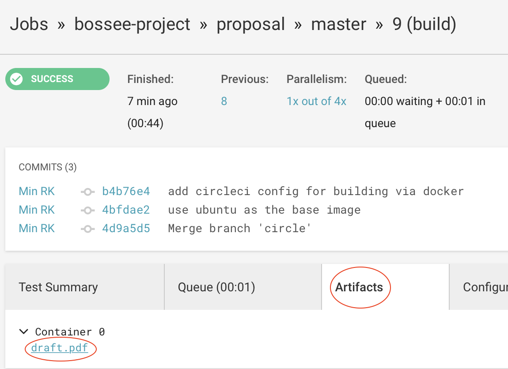

# Building Open Science Services on European E-Infrastructure (BOSSEE)

A proposal for [INFRAEOSC-02-2019](https://ec.europa.eu/info/funding-tenders/opportunities/portal/screen/opportunities/topic-details/infraeosc-02-2019)
started by participants in OpenDreamKit.

brainstorm docs: https://hackmd.io/fNJQFqgYQaCDGx-BFgz4XQ

Tentative aims:

https://github.com/bossee-project/proposal/blob/35544191b746e915ae2bb0ec73c3c08b0f87688c/objectives.tex#L12-L26

The draft is built automatically [on CircleCI](https://circleci.com/gh/bossee-project/proposal/tree/master).
To see a rendered draft, click on a successful build and then the 'Artifacts' tab, where there will be a link to the resulting PDF:

## To compile document

### install latex class (only required once)

    git submodule init; git submodule update

### to compile document

    make draft

produces ``draft.pdf`` if all goes well.

## writing

Most writing should occur by creating a task in `tasks/` based on `tasks/template.tex`. Then the task should be added to a workpackage file in the task list.

# outline

Outline of workpackages and tasks:

~11 FTEs

## WP1 Administration

FTEs: 1

## WP2 Structural improvements to Jupyter ("Enabling e-infrastructure")

FTEs: 2

1. Collaborating on notebooks
   1. Real-time collaboration development
   2. moving state of notebook into server,
   3. Exploring novel interaction environments (UPSud)
   4. (and more?)
1. Accessibility of Jupyter
   * Link to EINFRA-12-2017
1. Maintenance of core JupyterHub infrastructure
1. XEUS C++ kernels and infrastructure

## WP3: Developing the Jupyter ecosystem

FTEs: 2

1. Extension of binder service:
   * entry portal where binder service can be selected
      * mybinder.org
      * EOSC hub
      * Amazon S3 (against payment)
      * local machine?
   * more improvements
      * infrastructure for archive of containers for reproducibility (EuXFEL use case)
1. Exploring sustainability of the service
2. For reproducibility
   * Repo2docker development (more data sources, supported platforms)
   * integration of nbval (or similar button) and nbdime for display into notebook (maybe a button “validate”)
   * display state of cells (up-to-date, out-of-date, maybe up-to-date)? // depends on server-side state
1. Widgets - important to be able to host GUI-like interfaces
   * In general, improving interactive experience
   * standard scientific visualisations in notebook (including vectors)
   * controllable through widgets
   * state saveable within the notebook
   * also in 3d (-> k3d?)
1. Jupyter based workflow for computational and data science
   * middle way between interactive and automatic task execution (nbparametrise)
   * use notebooks as scripts (papermill)
   * coordinate execution of notebooks
   * connect to running processes (possible when document state is in kernel?) to see life updates
   * computational environment (links to binderhub improvements) (repo2docker)
      * Like repo2docker, but not images (build conda environments for hpc, for instance)
      * given some specification, build me the right environment
      * preservation of this environment
         * will it still work in 10 years time
         * [Following notes can be re-used in proposal to explain motivation]
         * Min: longevity of conda environments is short
            * most python packages are packaged per python version
               * pip does source install fallback
               * conda(-forge) relies on the the right python version
                  * not building for Python 3.5 anymore.

## WP4 Applications (Use cases? Pilot services?)

FTEs: 3

1. XFEL Open Science (LIGO OSC for XFEL?)
2. Personal data (Paul)
3. Maths demonstrator

at least one or two more

## WP5 Services / EOSC integration

FTEs: 2

1. Prototype/operate European Binder
2. Migrate service into EOSC
3. Cooperation with EOSC

## WP6 Education and dissemination

FTEs: 2

1. Training workshops
   1. N / year
   2. Some dedicated to diversity (WISE, etc.)
   3. Workshop surveys
1. Online training resources (competition issue?)
   1. Be more specific to our tooling (conda/python/jupyter/etc.)
   2. Generic resources like OpenAIRE, carpentry exist already
   3. Focus on gaps filled by our expertise; complementary, not competitive
1. Presentations at conferences to meet researchers where they are (maybe not task in its own right)
1. help desk (Nicolas)

